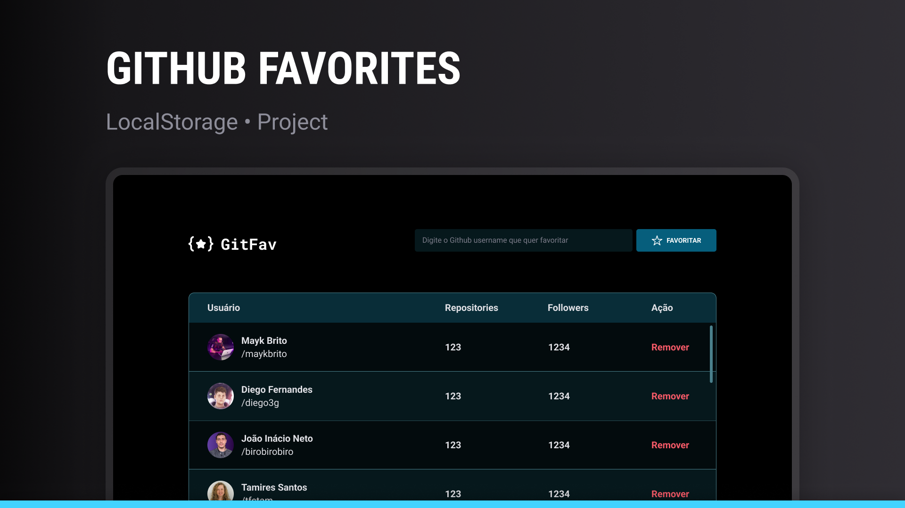

# Githubers

Githubers is a web application that allows you to search and keep a list of your favorite GitHub users profiles.

## 📋 About the Project

With an intuitive interface, users can add their favorite developers to a personalized list, view data such as repository count and followers, all while persisting data locally for later access.

## ✨ Features

🔍 Search GitHub users by username

- ⭐ Add users to favorites
- 📊 View basic profile information (repositories and followers)
- 🗑️ Remove users from favorites list
- 💾 Data persistence using localStorage
- 📱 Responsive design for different screen sizes

## 🚀 Technologies Used

- **HTML5**: Content structure
- **CSS3**: Styling and responsiveness
- **JavaScript (ES6+)**: Application logic
- **localStorage API**: Browser data persistence
- **Fetch API**: GitHub API integration
- **GitHub REST API**: User data retrieval
- **Object-Oriented Programming (OOP)**
- **ES6 Modules**

## 📚 Conceitos Aplicados

### Advanced JavaScript

- Classes and Inheritance
- ES6 Modules (import/export)
- Async/Await and Promises
- DOM Manipulation
- Events and Event Delegation
- JSON for data storage and transmission
- Array methods (map, filter, find)
- Destructuring
- Template Literals

### Architecture and Patterns

- MVC Pattern (Model-View-Controller)
- Separation of concerns
- Classes for code organization

### UX/UI

- Responsive interface
- Visual feedback for user actions
- Clean and intuitive layout

## 🌐 Demo

Access the online version: [Githubers Demo](https://maurodiogodev.github.io/Githubers/)

## 📝 Key Learnings

During this project's development, I practiced and deepened my knowledge in:

- External API integration
- Asynchronous data handling
- Browser data persistence
- Frontend application architecture
- Error handling and user experience
- Modern JavaScript practices

## 🧠 Future Enhancements

- [ ] Add authentication system
- [ ] Implement pagination for long lists
- [ ] Include additional profile statistics
- [ ] Add light/dark theme toggle
- [ ] Develop framework version like React, Vue or Angular

Design UI/UX by [Rocketseat](https://www.rocketseat.com.br/)

 
Developed with ❤️ as part of my web development learning journey.
 
Feel free to contribute or get in touch!
 

